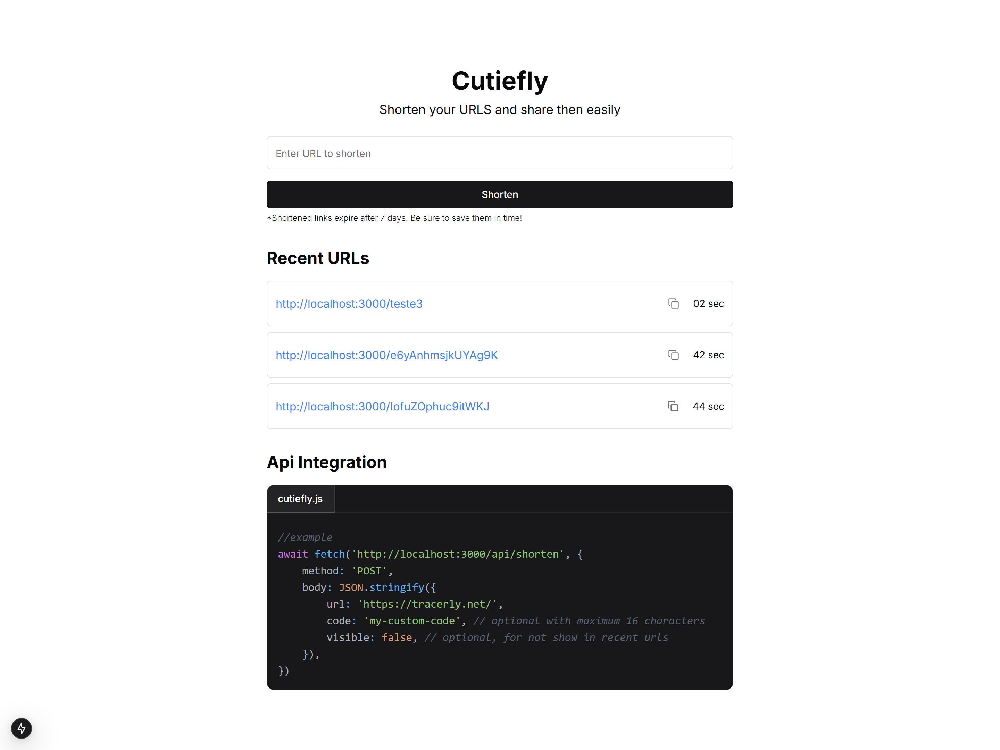

# Cutiefly

A disposable URL shortener with a public API. Paste a long link, get a short one — or call the API and get it back as JSON.



Live: https://cutiefly-sid.vercel.app

## Problem

Most shorteners want an account before they give you a link, and they keep that link — and its click data — forever. Cutiefly takes the opposite position: no sign-up, no tracking of who clicked what, and **every link is deleted after 7 days**. It exists for the throwaway case — a link in a chat message, a QR code on a slide, a share that stops mattering next week.

The API is the point as much as the UI: one `POST` with no key, no OAuth dance, no SDK.

## Features

- **Shorten a URL** — 16-character `nanoid` code, generated server-side.
- **Custom codes** — supply your own code (max 16 characters); rejected with `400` if already taken.
- **Redirect** — `GET /<code>` resolves the code and redirects; unknown codes render a 404 page.
- **Public API** — no authentication, no rate plan, `fetch`-able from anywhere.
- **Private links** — `visible: false` keeps a link out of the public "Recent URLs" list; the link itself still works.
- **Recent URLs** — the 3 most recent public links on the home page, with copy-to-clipboard and relative age.
- **Weekly purge** — a GitHub Actions cron calls `/api/clean` every Monday at 03:00 UTC, deleting everything older than 7 days.

Not implemented: click analytics, accounts, link editing or deletion by the user.

## Architecture

```
Browser ──────────────┐
                      │
                      ▼
        Next.js 15 (App Router, Vercel)
        ├── /                 UI (React 19, Tailwind, shadcn/ui)
        ├── /[code]           Server Component → redirect()
        └── /api/*            Route Handlers
                      │
                      ▼
        Prisma 6 + @prisma/adapter-neon
                      │
                      ▼
        Neon (serverless PostgreSQL over WebSocket)

GitHub Actions (cron, Mon 03:00 UTC) ──► GET /api/clean
```

One process, one table. No queue, no cache, no background worker — the cleanup job is an external cron hitting an HTTP endpoint, which is all a 7-day TTL needs.

**Data model** (`prisma/schema.prisma`):

| Field         | Type       | Notes                                    |
| ------------- | ---------- | ---------------------------------------- |
| `id`          | `String`   | `cuid()`                                 |
| `originalUrl` | `String`   | target                                   |
| `shortCode`   | `String`   | unique — the lookup key                  |
| `createdAt`   | `DateTime` | drives the 7-day purge                   |
| `isPrivate`   | `Boolean`  | hides the link from the public recents    |

## API

### `POST /api/shorten`

```ts
await fetch("https://cutiefly-sid.vercel.app/api/shorten", {
  method: "POST",
  headers: { "Content-Type": "application/json" },
  body: JSON.stringify({
    url: "https://example.com/a/very/long/link",
    code: "my-custom-code", // optional, max 16 chars
    visible: false, // optional, omit from the public recents list
  }),
})
```

| Field     | Type      | Required | Default              |
| --------- | --------- | -------- | -------------------- |
| `url`     | `string`  | yes      | —                    |
| `code`    | `string`  | no       | `nanoid(16)`         |
| `visible` | `boolean` | no       | `true` (link listed) |

`200` → `{ "url": "https://cutiefly-sid.vercel.app/<code>" }`
`400` → `{ "error": "Code too long, maximum 16 characters" }` or `{ "error": "Short code already exists" }`

### `GET /api/urls`

The 3 most recent **public** links, newest first, as raw `Url` rows.

### `GET /api/clean`

Deletes every link older than 7 days. Returns `{ "success": true }`. Called by the scheduled workflow; see the note in [Security](#security).

### `GET /<code>`

`307` redirect to the original URL, or the 404 page if the code is unknown or expired.

## Security

Stated as it actually is, not as it should be:

- **URL validation** — the browser form uses `<input type="url">`, so the UI won't submit garbage. **The API does not validate `url` at all**: `POST /api/shorten` stores whatever string it receives, including `javascript:` and `data:` URIs, and `/[code]` hands it straight to Next.js `redirect()`. Treat any short link as untrusted input.
- **Protocol filtering** — none. See above.
- **Rate limiting** — none. The endpoint is open and unauthenticated; a loop can fill the table.
- **Code generation** — `nanoid(16)` (≈95 bits, not guessable by enumeration). Custom codes are capped at 16 characters and checked for collision before insert, so codes are unique but **not** secret — anyone can request a code and see whether it is taken.
- **Private links** — `isPrivate` only removes the link from `GET /api/urls`. It is not access control; anyone with the code can follow it.
- **`/api/clean`** — a `GET` with no auth. Anyone can trigger the purge early, which deletes only links already past 7 days, so the blast radius is small — but it should be a `POST` behind a shared secret.

Hardening the first three is the next thing worth doing here.

## Testing

Vitest + Testing Library, jsdom environment, Prisma mocked with `vitest-mock-extended`. 26 tests across 11 files, run on every push and PR to `master` (`.github/workflows/ci.yml`).

```bash
pnpm test
```

| Area           | Covered                                                                      |
| -------------- | ---------------------------------------------------------------------------- |
| Route handlers | `shorten` (generated code, custom code, too long, collision), `urls`, `clean` |
| Redirect page  | known code redirects, unknown code renders the 404                            |
| Components     | form submit + loading state, list fetch/empty/copy, container refresh, 404    |
| Layout/page    | metadata and render smoke tests                                              |

## Running locally

Requires Node 18+ and a PostgreSQL database reachable through the Neon serverless driver (a free Neon project is the path of least resistance).

```bash
pnpm install          # runs `prisma generate` via postinstall
cp .env.example .env  # then fill in the values below
pnpm prisma migrate dev
pnpm dev
```

| Variable               | Purpose                                             |
| ---------------------- | --------------------------------------------------- |
| `DATABASE_URL`         | Neon pooled connection string                       |
| `DIRECT_URL`           | Neon direct connection, used by migrations          |
| `NEXT_PUBLIC_BASE_URL` | Origin used to build returned links, e.g. `http://localhost:3000` |

## Stack

Next.js 15 · React 19 · TypeScript · Tailwind CSS + shadcn/ui · Prisma 6 · Neon PostgreSQL · Vitest · Vercel
